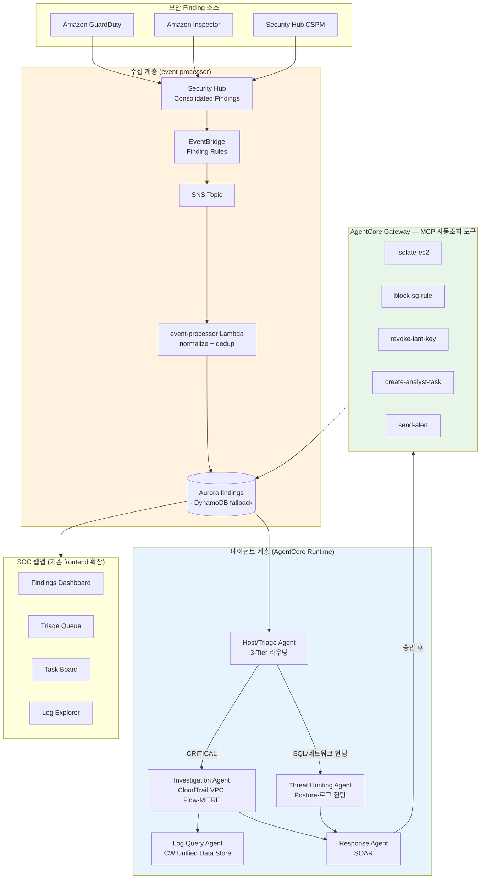

# Agentic SOC on AWS — 설계 문서

> **목표**: AWS 네이티브 보안 시그널(GuardDuty / Security Hub / Inspector / CloudWatch Unified Data Store)을
> **에이전틱 AI**로 연결하여 `탐지 → 트리아지 → 조사 → (승인 후) 자동 대응` 루프를 직접 구축한다.
> 네이티브 시그널과 Bedrock AgentCore를 결합하면 별도 도구 없이도 보안 운영 센터를 구성할 수 있다.

---

## 0. 핵심 구성 요소

본 SOC는 다음 플랫폼 요소 위에 구축된다. 멀티 에이전트 라우팅·이벤트 정규화·배포 인프라가
하나의 일관된 골격을 이루며, 그 위에 보안 도메인 에이전트와 수집·대응 계층을 얹는다.

| 구성 요소 | 역할 |
|---|---|
| **3-Tier 라우팅** (`soc-host-agent-runtime/server.py`)<br>Cache → 키워드/Haiku 분류 → 단일/병렬 직접호출 → Sonnet 오케스트레이션 | **Triage 라우팅의 핵심 엔진**. finding을 분류해 단일 보안 에이전트 직접 호출 또는 멀티 에이전트 상관분석으로 라우팅 |
| **이벤트 정규화 파이프라인** (`event-processor/index.py`)<br>EventBridge → SNS → Lambda → Aurora (DynamoDB fallback) | **Finding 수집 계층**. GuardDuty / Security Hub / Inspector finding을 정규화하고 severity 매핑·중복제거·알림 처리 (CloudTrail은 finding 소스가 아닌 로그) |
| **Investigation Agent** (`investigation-agent-runtime/`)<br>CloudWatch Logs 검색, 로그 이상탐지, CloudTrail 변경추적, VPC Flow / DNS 분석, MITRE ATT&CK 매핑 | finding 심층 조사 워크플로우. 상관 분석으로 근본 원인을 추정하고 대응 가이드를 생성 |
| **Posture 분석 / Threat Hunting Agent**<br>Steampipe SQL(설정 약점) + 로그 기반 행위 헌팅 | 리소스 설정 약점·공격 경로 점검(CSPM)과 로그에서 공격자 행위·흔적 추적(assume breach) |
| **CDK 멀티스택 + CodeBuild ARM64 자동 빌드** (`cdk/`)<br>`config/agents.py` 단일 레지스트리, 에이전트별 독립 Runtime + 최소권한 IAM | 배포 인프라 전체. 에이전트 레지스트리 기반으로 7개 런타임을 일관 배포 |
| **AgentCore Memory 통합** (`server.py`)<br>actor별 facts/preferences/summaries 장기기억 | 자산·위협 인텔·과거 인시던트 메모리. 리소스별 보안 이력 namespace |
| **React + CloudFront + Cognito + API GW** (`frontend/`, `infra_stack.py`)<br>SSE 스트리밍 채팅, 대시보드, REST API Lambda | **SOC 웹앱**. Findings 대시보드 / Log Explorer / Task 보드 / 채팅 |
| **데이터 저장소** (`infra_stack.py`)<br>**Aurora**(findings·reports) + **DynamoDB**(tasks·conversations·agent-state·log-queries) | 역할 분담은 아래 "데이터 저장소 설계" 참고 |

**핵심 구축 대상**: (1) 보안 에이전트의 도구/프롬프트, (2) GuardDuty/Security Hub/Inspector 수집 룰,
(3) SOAR 자동조치 Lambda + AgentCore Gateway(승인 게이트), (4) Log Explorer UI.

### 데이터 저장소 설계 — Aurora vs DynamoDB

두 저장소를 **데이터 특성에 따라** 나눠 쓴다.

| 데이터 | 저장소 | 이유 |
|---|---|---|
| **findings** | **Aurora** (Postgres, Data API) | 대시보드의 severity별 집계(`GROUP BY`), 상태 필터·정렬·페이지네이션, 전체 건수 `COUNT` 등 **분석 질의**가 핵심. RDBMS가 적합. event-processor가 `upsert_finding`으로 쓰고, API가 집계로 읽는다. |
| **reports** | **Aurora** | Report Agent 합성 결과. 타입·기간별 조회/추세 비교 등 질의 필요. |
| **tasks** | **DynamoDB** | SOAR 승인 워크플로우의 상태머신(pending_approval → executed/done). 키 기반 단순 조회·갱신. |
| **conversations** | **DynamoDB** | 채팅 스레드. user_id 파티션 키로 빠른 조회. |
| **agent-state / log-queries** | **DynamoDB** | 에이전트 상태, 저장된 LogsQL 쿼리. 키-값 패턴. |

> **이중화**: findings는 **Aurora 우선, DynamoDB fallback**이다(`AURORA_ENABLED`가 false이거나 Aurora 질의
> 실패 시 DynamoDB `findings` 테이블의 status-index GSI 사용). 그래서 CDK가 두 저장소를 모두 생성한다.
> 정상 운영에서는 Aurora가 finding의 단일 진실 공급원(SoT)이며, 대시보드 헤드라인 집계도 Aurora 기준이다.

---

## 1. 타깃 아키텍처 — Agent Graph 패턴

[AWS Public Sector 블로그](https://aws.amazon.com/blogs/publicsector/how-government-agencies-can-transform-cybersecurity-operations-with-amazon-bedrock-agentcore/)가 권장하는 **Agent Graph** 패턴을 채택한다.
단순 순차 파이프라인이 아닌 **예측 가능한 에스컬레이션 경로 + 감사 추적 + 결정론적 의사결정**으로 보안 컴플라이언스 요건을 충족한다.



### 1-Tier 라우팅 = 분류기

`classifier.py`의 키워드 → Haiku → 카테고리 라우팅으로 **보안 카테고리**를 분류한다:

```python
# 기존: infra / db / monitoring / steampipe / k8s / incident / istio
# SOC:  triage / investigation / hunting / logquery / response
KEYWORD_MAP = [
    (r'\b(?:GuardDuty|finding|침해|malware|악성)\b', 'investigation'),
    (r'\b(?:IAM|권한|key|credential|MFA|암호화)\b', 'hunting'),
    (r'\b(?:VPC Flow|CloudTrail|DNS|로그|log)\b', 'logquery'),
    (r'\b(?:격리|차단|isolate|block|revoke|대응)\b', 'response'),
]
```

`server.py`의 fast-path / parallel-path / full-path 분기는 **코드 변경 없이** 그대로 작동한다.

---

## 2. 에이전트 카탈로그

`config/agents.py` 레지스트리는 다음 에이전트로 구성된다:

| 에이전트 | 런타임 | 핵심 도구 | 모델 |
|---|---|---|---|
| **Host/Triage** | `soc-host-agent-runtime` | 분류·라우팅·종합 (2-Tier 분류) | Sonnet (분류 Haiku) |
| **Investigation** | `investigation-agent-runtime` | GuardDuty finding 파싱, CloudTrail 상관, VPC Flow 조회, 타임라인 재구성, MITRE ATT&CK 매핑 | Sonnet |
| **Posture 분석** | `hunting-agent-runtime` | IAM 과다권한, 노출된 SG, 미암호화 리소스, 공격 경로 SQL 점검(CSPM) | Sonnet |
| **Threat Hunting** | `threat-hunting-agent-runtime` | CloudTrail/DNS/VPC Flow 로그 기반 행위 헌팅, IOC 평판 대조(assume breach) | Sonnet |
| **Log Query** | `logquery-agent-runtime` | 자연어→LogsQL 생성, VPC Flow/CloudTrail/DNS/WAF 조회 | Sonnet |
| **Response (SOAR)** | `response-agent-runtime` | AgentCore Gateway 통해 격리/차단/revoke 제안 (**승인 게이트 필수**) | Sonnet |
| **Report** | `report-agent-runtime` | 보안 리포트·인시던트 타임라인·컴플라이언스 보고서 합성 | Sonnet |

### Triage Agent 시스템 프롬프트 (핵심 발췌)

```
당신은 보안 위협 분류 전문가입니다. Security Hub finding을 분석하여:
1. 위협 유형 분류 (Malware / UnauthorizedAccess / Recon / CredentialAccess / ...)
2. 우선순위 스코어 산출 (1-10) — severity + 자산 중요도 + 침해 신뢰도
3. 자동조치 가능 여부 판단 (격리/차단/revoke 가능한 명확한 케이스인가?)
4. 라우팅 결정: investigation / hunting / response / human-task
반드시 structured JSON으로 응답하세요.
```

---

## 3. Finding 수집 — Security Hub 통합

기존 `infra_stack.py`의 EventBridge 룰에 Security Hub 소스를 추가한다 (`rules_config`에 한 줄):

```python
# infra_stack.py — rules_config 확장
("SecurityHub", {
    "source": ["aws.securityhub"],
    "detail-type": ["Security Hub Findings - Imported"],
}),
("Inspector", {
    "source": ["aws.inspector2"],
    "detail-type": ["Inspector2 Finding"],
}),
```

EventBridge 필터로 CRITICAL/HIGH/MEDIUM만 통과:

```json
{
  "source": ["aws.securityhub"],
  "detail-type": ["Security Hub Findings - Imported"],
  "detail": { "findings": { "Severity": { "Label": ["CRITICAL", "HIGH", "MEDIUM"] } } }
}
```

`event-processor/index.py`에 normalize 함수 추가 (기존 `normalize_guardduty_event` 패턴 복제):

```python
def normalize_securityhub_finding(raw, detail, now):
    finding = detail.get('findings', [{}])[0]
    severity = finding.get('Severity', {}).get('Label', 'INFORMATIONAL').lower()
    return {
        'alert_id': f"sh-{finding.get('Id', uuid.uuid4())}",
        'title': finding.get('Title', ''),
        'description': finding.get('Description', '')[:500],
        'service': finding.get('ProductName', 'SecurityHub'),
        'severity': {'critical':'critical','high':'high','medium':'medium'}.get(severity, 'info'),
        'finding_type': finding.get('Types', [''])[0],
        'resource_id': (finding.get('Resources') or [{}])[0].get('Id', ''),
        'source': 'aws.securityhub',
        'status': 'active', 'created_at': now, 'updated_at': now,
        'ttl': int(time.time()) + TTL_SECONDS,
    }
```

### ⚠️ 알려진 이슈 — Inspector ↔ Security Hub 중복 (개선 예정)

Amazon Inspector finding은 **자동으로 Security Hub로도 전달**된다. 따라서 Inspector 룰과
Security Hub 룰을 **동시에 구독하면 같은 취약점이 두 번 수집**된다(현재 dedup 없음).

향후 **수집 소스를 환경별 설정(CDK context)으로** 만들어 해결한다:
- **Security Hub를 쓰는 고객**: Security Hub만 수집(GuardDuty/Inspector/Macie는 Security Hub가
  Consolidated Findings로 집계하므로 직접 수집 불필요) → 중복 원천 차단.
- **Security Hub를 안 쓰는 고객**: GuardDuty/Inspector를 직접 수집.

> CloudTrail은 위 모든 경우에서 finding 소스가 아니다(감사 로그). Investigation/Log Query 전용.

---

## 4. SOAR — AgentCore Gateway 자동조치

[AgentCore Gateway](https://docs.aws.amazon.com/bedrock-agentcore/latest/devguide/gateway.html)는 기존 Lambda를 별도 코드 없이 MCP 도구로 변환한다.

| MCP Tool | Lambda 동작 | 트리거 조건 | 승인 |
|---|---|---|---|
| `isolate-ec2` | 격리 SG로 이동 + 스냅샷 | GuardDuty EC2 침해 | ✅ 필수 |
| `revoke-iam-credentials` | Access Key 비활성화 | Credential exposure | ✅ 필수 |
| `block-sg-rule` | 인바운드 규칙 제거 | 비인가 포트 노출 | ✅ 필수 |
| `create-analyst-task` | DynamoDB `tasks` 기록 | 복잡 finding | ⬜ 자동 |
| `send-alert` | SNS/Slack 알림 | critical/high | ⬜ 자동 |

> **승인 게이트**: write 액션은 Triage Agent가 자동 실행하지 않는다. `tasks` 테이블에 "대기 중 조치"로 기록하고,
> 웹앱 Task Board에서 분석가가 승인 → Response Agent가 Gateway 호출. (기존 `tasks_table` 그대로 사용)

---

## 5. Log Explorer — CloudWatch Unified Data Store

[CloudWatch Unified Data Store](https://aws.amazon.com/blogs/aws/amazon-cloudwatch-introduces-unified-data-management-and-analytics-for-operations-security-and-compliance)로 보안 로그를 중앙화하고, 웹앱에 Log Explorer 메뉴를 추가한다.

### 로그 소스 (Org-level Centralization Rules)

| 소스 | 수집 | 내장 스키마 |
|---|---|---|
| VPC Flow Logs | Managed Data Source | ✅ |
| CloudTrail (Mgmt/Data) | Managed Data Source | ✅ |
| Route 53 DNS Query | Managed Data Source | ✅ |
| NLB / WAF Logs | Managed Data Source | ✅ |
| ALB Access Logs | S3 → 포워딩 + Grok parser | ⚠️ |
| Network Firewall | Kinesis Firehose → CW | ⚠️ |

### Log Query Agent — 자연어→LogsQL + Finding 연계

Investigation Agent가 finding 조사 시 **연관 로그 쿼리 세트를 자동 생성**해 웹앱에 pre-filled로 전달:

```python
@tool
def generate_investigation_queries(finding: dict) -> list[dict]:
    """Finding 유형별 로그 조사 쿼리 자동 생성"""
    ip = finding.get('sourceIPAddress')
    if finding['finding_type'].startswith('UnauthorizedAccess'):
        return [
            {"source": "cloudtrail", "label": "해당 IP API 호출 이력",
             "query": f"filter sourceIPAddress='{ip}' | sort @timestamp desc | limit 100"},
            {"source": "vpc-flowlogs", "label": "네트워크 연결 패턴",
             "query": f"filter srcaddr='{ip}' | stats sum(bytes) by dstaddr,dstport | sort sum_bytes desc"},
        ]
    # Recon, CredentialAccess 등 유형별 쿼리 패키지...
```

웹앱 Log Explorer는 채팅 SSE 인프라 위에서 동작하며, `StartQuery`/`GetQueryResults` Lambda를 `api_routes`에 추가한다.

---

## 6. 구현 로드맵

| Phase | 기간 | 산출물 |
|---|---|---|
| **P0: 기반 구성** | 3일 | `agents.py` 보안 에이전트 레지스트리, 프로젝트 골격·배포 파이프라인 구성 |
| **P1: 수집 + 대시보드** | 1주 | GuardDuty/Security Hub/Inspector 수집 룰, `event-processor` 정규화, Findings 대시보드 |
| **P2: Triage + Investigation** | 2주 | 분류기 보안 카테고리화, Investigation Agent(CloudTrail/VPC Flow/DNS/MITRE) |
| **P3: Hunting + Log Explorer** | 2주 | Posture 분석(Steampipe SQL) / Threat Hunting Agent, Log Query Agent, Log Explorer UI |
| **P4: SOAR** | 2주 | 자동조치 Lambda, AgentCore Gateway 등록, 승인 워크플로우 Task Board 연동 |
| **P5: Memory + 감사** | 1주 | 자산/위협인텔/인시던트 Memory, AgentCore Observability 감사 추적 |

---

## 7. 참고 리소스

- [Government SOC with AgentCore (Agent Graph 패턴)](https://aws.amazon.com/blogs/publicsector/how-government-agencies-can-transform-cybersecurity-operations-with-amazon-bedrock-agentcore/)
- [AgentCore Gateway — Lambda→MCP](https://docs.aws.amazon.com/bedrock-agentcore/latest/devguide/gateway.html)
- [AgentCore Observability](https://docs.aws.amazon.com/bedrock-agentcore/latest/devguide/observability.html)
- [Security Hub + EventBridge 자동화](https://docs.aws.amazon.com/securityhub/latest/userguide/securityhub-cloudwatch-events.html)
- [CloudWatch Unified Data Management](https://aws.amazon.com/blogs/aws/amazon-cloudwatch-introduces-unified-data-management-and-analytics-for-operations-security-and-compliance)
- [AgentCore Samples (05-blueprints)](https://github.com/awslabs/amazon-bedrock-agentcore-samples/)
- [AgentCore Workshop](https://catalog.us-east-1.prod.workshops.aws/workshops/1f45e85a-c96b-4ec2-93b3-e83304fc559a/en-US)

---

## 8. Memory & Observability (P5)

### AgentCore Memory — SOC 컨텍스트 연속성
기존 AgentCore Memory 통합을 보안 도메인으로 재해석. 3개 장기기억 전략(`scripts/create-memory.sh`):
- **SecurityKnowledge** (`/facts/{actorId}/`) — 자산, 위협 인텔, 관찰된 IoC 등 보안 지식
- **AnalystPreference** (`/preferences/{actorId}/`) — 분석가 워크플로우 선호
- **InvestigationSummarizer** (`/summaries/{actorId}/{sessionId}/`) — 과거 조사·인시던트 세션 요약

Host Agent가 매 질의마다 `retrieve_memory_records`로 관련 메모리를 끌어와 시스템 프롬프트에 주입
(`_retrieve_long_term_memories`). 단기기억(대화 맥락)은 `AgentCoreMemorySessionManager`가 자동 관리.
세션 ID = conversation_id, actor ID = 분석가 user_id.

### Observability — 감사 추적
- **AgentCore Runtime**: CloudWatch + OpenTelemetry 기반으로 에이전트 실행 경로(도구 호출, 토큰,
  지연)를 자동 추적 — 별도 코드 불필요. SOC 컴플라이언스의 에이전트 행위 감사를 충족.
- **SOAR 액션 감사** (`soar-lambdas/index.py` `_audit`): 모든 대응 시도(거부 포함)를 구조화된
  `SOAR_AUDIT` JSON 레코드로 CloudWatch Logs에 기록 — action/risk/approved/params/success/timestamp.
  이 로그 그룹을 Log Query Agent로 질의하면 "누가 무엇을 언제 조치했는가"를 추적 가능.
- **승인 추적** (`tasks` 테이블): `approved_by`, `execution_result`, `updated_at` 기록 — 승인 워크플로우의
  감사 기록이 영구 보존.

---

## 부록 A: 컴포넌트 구조 치트시트

```
soc-host-agent-runtime/        Host/Triage — 2-Tier 분류 라우팅(classifier.py), 멀티 에이전트 오케스트레이션
investigation-agent-runtime/   Investigation — GuardDuty 파싱, CloudTrail 상관, VPC Flow, MITRE ATT&CK
hunting-agent-runtime/         Posture 분석 — Steampipe SQL로 설정 약점·공격 경로 점검(CSPM)
threat-hunting-agent-runtime/  Threat Hunting — 로그 기반 행위 헌팅 + IOC 평판 대조
logquery-agent-runtime/        Log Query — 자연어→LogsQL, CW Unified Data Store 조회
response-agent-runtime/        Response — SOAR 조치 제안(승인 게이트)
report-agent-runtime/          Report — 보안 리포트·타임라인·컴플라이언스 합성
event-processor/index.py       Finding 수집 — GuardDuty/Security Hub/Inspector 정규화 (CloudTrail은 로그)
soar-lambdas/                  SOAR 실행 — isolate-ec2 / block-sg / revoke-key / revoke-role-session / alert / task
cdk/                           InfraStack + AgentCoreStack, config/agents.py 에이전트 레지스트리
  Aurora (Postgres)            findings · reports (집계·필터·정렬 — SoT)
  DynamoDB                     tasks · conversations · agent-state · log-queries (+ findings fallback)
frontend/                      Dashboard / Findings / Log Explorer / Task Board / Chat / 온보딩 Status
```
